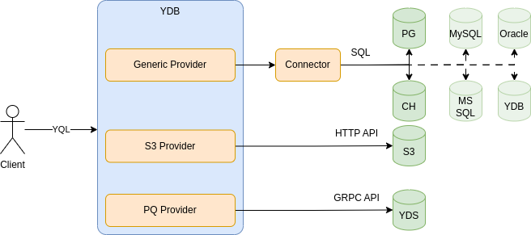
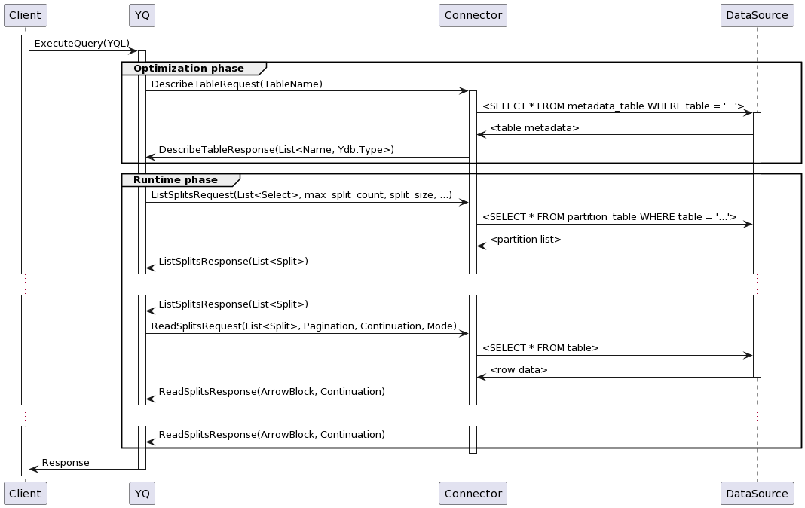
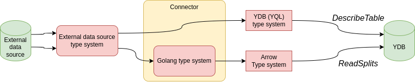

# Инструкция по разработке коннектора

## Концепция

**Коннектор** - специальный микросервис, выступающий в роли прокси между YDB и внешними источниками данных. Коннекторы формируют специальный слой абстракции, изолирующий YDB от специфики сторонних хранилищ. Благодаря этому YDB может через один и тот же интерфейс работать с разнообразными источниками данных.

Заметим, что внутри YDB активно применяется и более низкоуровневая абстракция аналогичного назначения - **[провайдеры](https://github.com/ydb-platform/ydb/tree/main/ydb/library/yql/providers/)**. Это библиотеки, написанные на языке С++ и отвечающие за оптимизацию запросов и выполнение ввода-вывода во внешние источники данных. Большинство провайдеров поддерживают только какой-то один источник данных (например, провайдер `s3` отвечает только за работу с объектным хранилищем); их разработка чрезвычайно трудозатратна.

В связи с этим было принято решение реализовать `generic` провайдер - универсальную библиотеку, через которую YDB сможет работать с любыми источниками посредством обращений к внешниму микросервису - коннектору. 



Благодаря этому приёму добавление новых источников значительно облегчается, а кодовая база YDB не распухает от новых зависимостей и остаётся относительно стабильной. Коннектор может быть реализован на любом языке программирования по имеющейся GRPC-спецификации.

### Сетевой интерфейс коннектора

Коннектор `fq-connector-go` - типичный микросервис, который может одновременно отвечать на запросы сразу по нескольким слушающим сокетам:
* Основной GRPC-сервер - порт `2130` ([Protobuf API](https://github.com/ydb-platform/ydb/tree/main/ydb/library/yql/providers/generic/connector/api) хранится в репозитории YDB).
* HTTP-сервер, отдающий статистику - порт `8766`.
* HTTP-сервер профилировщика Go Runtime - порт `6060`.

В production среде в качестве клиента к коннектору выступает сам YDB (исполняемый файл `ydbd`).

В процессе разработки и отладки для обращения к коннектору можно пользоваться:
* Встроенной командой `fq-connector-go client`;
* Встроенной командой `fq-connector-go bench`;
* Инструментом [dqrun](https://github.com/ydb-platform/ydb/tree/24.1.9/ydb/library/yql/tools/dqrun), основанным на кодовой базе YDB;
* Инструментом [kqprun](https://github.com/ydb-platform/ydb/tree/24.1.9/ydb/tests/tools/kqprun), основанным на кодовой базе YDB.

### Протокол работы коннектора

Любой пользовательский запрос в YDB (да и во всех современных базах данных) выполняется в два этапа:
* **Фаза оптимизации** запроса. В оперативной памяти YDB запрос представляется виде графа, узлами которого являются "лямбды" - функции, описывающие процесс извлечения, обработки и преобразования данных. Специальные оптимизаторы многократно обходят этот граф и трансформируют его с целью ускорения фазы выполнения. В конечном итоге из графа конструируется внутренняя "программа", которая исполняется движком на следующем этапе.
* **Фаза выполнения** запроса или "runtime". На данном этапе движок потоково извлекает данные из внешних источников и выполняет над этими данными операции в соответствии с запросом пользователя.



В фазе оптимизации запроса YDB обращается за метаданными таблицы через метод `DescribeTable`. В фазе выполнения запроса YDB сначала просит коннектор разбить таблицу на **сплиты** (split - в большинстве случаев это синоним горизонтальной партиции таблицы) с помощью метода `ListSplits`, а затем извлекает данные сплитов через метод `ReadSplits`. 

### DataSource

Внешние источники данных в сервисе `fq-connector-go` скрываются за интерфейсом [DataSource](https://pkg.go.dev/github.com/ydb-platform/fq-connector-go@v0.2.6/app/server/datasource#DataSource). У него всего-навсего два метода: метод для описания метаданных таблицы и для извлечения данных. Несмотря на лаконичность интерфейса, имплементировать его придётся постепенно, по частям, добавляя новую функциональность. 

Логика работы с реляционными СУБД может быть в значительной степени обобщена и переиспользована в коде, относящемся к разным базам данных, поэтому имплементация `DataSource` для РСУБД у нас на данный момент [одна](https://github.com/ydb-platform/fq-connector-go/blob/v0.2.6/app/server/datasource/rdbms/data_source.go#L26) - с помощью структуры [Preset](https://pkg.go.dev/github.com/ydb-platform/fq-connector-go@v0.2.6/app/server/datasource/rdbms#Preset) в ней меняются только источнико-специфичные части:

* [ConnectionManager](https://pkg.go.dev/github.com/ydb-platform/fq-connector-go@v0.2.6/app/server/datasource/rdbms/utils#ConnectionManager) отвечает за создание сетевых соединений, которые описываются абстракцией [Connection](https://pkg.go.dev/github.com/ydb-platform/fq-connector-go@v0.2.6/app/server/datasource/rdbms/utils#Connection). Этот интерфейс напоминает усечённую версию `*sql.DB` из стандартной библиотеки.
* [SQLFormatter](https://pkg.go.dev/github.com/ydb-platform/fq-connector-go@v0.2.6/app/server/datasource/rdbms/utils#ConnectionManager) формирует запросы к источнику на принятом у него диалекте SQL.
* [TypeMapper](https://pkg.go.dev/github.com/ydb-platform/fq-connector-go@v0.2.6/app/server/datasource#TypeMapper) отвечает за преобразование метаданных о таблице из системы типов источника данных в систему типов языка `YQL`, использующегося в `YDB`, то есть отвечает за одно из преобразований типов, подробно описанных ниже.
* [SchemaProvider](https://pkg.go.dev/github.com/ydb-platform/fq-connector-go@v0.2.6/app/server/datasource/rdbms/utils#SchemaProvider) извлекает метаинформацию о таблице (количество, имена и типы столбцов), чтобы в дальнейшем отправить её в `YDB` в понятном ей формате.

Эти интерфейсы - наиболее верхнеуровневые, но есть ещё и несколько вспомогательных. В написании имлпементаций этих интерфейсов и заключается наша основная задача.

### О трансформации данных и метаданных

Коннектор должен превращать (трансформировать) данные из внешних систем в формат, поддерживаемый YDB, а также описывать эти данные в понятной YDB системе типов. 

С точки зрения работы с **метаданными** такой системой типов является [система типов](https://ydb.tech/docs/ru/yql/reference/types/) языка YQL. Описания типов хранятся в [Public Protobuf API YDB](https://github.com/ydb-platform/ydb/blob/main/ydb/public/api/protos/ydb_value.proto). По запросу от YDB (метод `DescribeTable`) коннектор должен извлечь описание таблицы из источника (это описание, разумеется, хранится в системе типов, специфичной для источника) и предоставить схему таблицы в системе типов YQL.

В качестве формата передачи **данных** используется колоночный формат [Apache Arrow (тип IPC Streaming)](https://arrow.apache.org/docs/cpp/api/ipc.html). Колоночное представление данных часто встречается в аналитических СУБД, поскольку позволяет сэкономить дорогостоящие операции ввода-вывода. В Arrow используется собственная [система типов](https://arrow.apache.org/docs/cpp/api/datatype.html). При этом коннекторы вычитывают данные из соединения с внешним источником данных в объекты-приёмники ([Acceptor](https://pkg.go.dev/github.com/ydb-platform/fq-connector-go@v0.2.6/app/server/paging#Acceptor)), которые описываются в системе типов Go: `rows.Scan(acceptors...)`. Уже позднее эти объекты накапливаются в колоночных буферах ([ColumnarBuffer](https://pkg.go.dev/github.com/ydb-platform/fq-connector-go@v0.2.5/app/server/paging#ColumnarBuffer)), те, в свою очередь, сериализуются и отправляются по сети в сторону YDB в формате Arrow.

Таким образом в коннекторе встречаются сразу 4 системы типов:
* Система типов YDB (YQL).
* Система типов источника данных.
* Система типов Apache Arrow.
* Система типов языка Go.



Код, выполняющий *трансформацию* между этими системами типов, традиционно сконцентрирован в файлах `type_mapper.go` ([PG](https://github.com/ydb-platform/fq-connector-go/blob/main/app/server/datasource/rdbms/postgresql/type_mapper.go), [CH](https://github.com/ydb-platform/fq-connector-go/blob/main/app/server/datasource/rdbms/clickhouse/type_mapper.go)). 

Ещё один смысл, вкладываемый в термин *трансформации* данных - это  преобразование данных из строкового в колоночное представление. Логика перекладывания данных из элементов строки (row) в колоночные буфера реализована однократно для всех источников данных в функции [RowTransformerDefault.AppendToArrowBuilders](https://pkg.go.dev/github.com/ydb-platform/fq-connector-go@v0.2.6/app/server/paging#RowTransformerDefault.AppendToArrowBuilders).


## Пошаговая инструкция

### Первые шаги

Работу по добавлению нового источника можно начать с создания в папке [rdbms](https://github.com/ydb-platform/fq-connector-go/tree/main/app/server/datasource/rdbms) подпапки для нового источника данных. Нейминг должен соответствовать [enum](https://github.com/ydb-platform/ydb/blob/main/ydb/library/yql/providers/generic/connector/api/common/data_source.proto#L29-L37) из YDB API. В этой папке можно реализовать перечисленные выше интерфейсы в самом примитивном виде (на заглушках), и заполнить ими структуру `Preset`.

Сразу после этого новый источник данных надо подключить [в фабрике](https://github.com/ydb-platform/fq-connector-go/blob/main/app/server/datasource/rdbms/data_source_factory.go#L27-L40) источников. После этого вы сможете делать обращения к коннектору через тестовый клиент `fq-connector-go client`.

Скомпилируйте и запустите коннектор командой:
```
make build
make run
```

Затем подготовьте файл с конфигурацией клиента [по примеру](https://github.com/ydb-platform/fq-connector-go/blob/main/scripts/debug/config/client/pg.local.txt) и попробуйте сходить в коннектор:

```
./fq-connector-go client ./your/config.txt
```

Если в коде сервиса не будет ошибок, вы получите какие-то ответы (в соответствии с данными, "зашитыми" в заглушках). После этого можно приступать к наполнению `DataSource` источнико-специфичным кодом.

### ConnectionManager

Начать стоит с реализации интерфейса `СonnectionManager`. Здесь вам нужно просто научиться по параметрам, пришедшим в структуре типа `TDataSourceInstance`, конструировать сетевое соединение к базе. Наиболее хрестоматийные примеры можно посмотреть в папках [clickhouse](https://github.com/ydb-platform/fq-connector-go/blob/main/app/server/datasource/rdbms/clickhouse/connection_manager.go) и [postgresql](https://github.com/ydb-platform/fq-connector-go/blob/main/app/server/datasource/rdbms/postgresql/connection_manager.go).

> [!IMPORTANT]
> Для работы с внешними источниками данных вам потребуется **драйвер** - библиотека на языке Go, которая реализует протокол взаимодействия с базой. Существуют важные нюансы при выборе библиотек:
> * Лицензионная чистота (используем только MIT, Apache, BSD и подобные permissive лицензии; из лицензий с ограничениями разрешена MPL-2.0).
> * При прочих равных стараемся выбирать библиотеку, которая не встраивается в `database/sql`, а предоставляет свою реализацию всех необходимых нам абстракций (стандартная библиотека Go в этом месте тормозит, так как использует `reflect`).
> * Существует закрытый для внешних лиц перечень разрешённых версий сторонних библиотек. Когда выберете библиотеку, уточните у ментора, какую версию данной библиотеки можно использовать.

Некоторые источники данных предоставляют несколько сетевых интерфейсов для доступа данных: например, к ClickHouse можно подключиться как по TCP-протоколу, так и по HTTP-протоколу. Изучите ваш источник данных в этом отношении. В большинстве случаев достаточно только реализации `NATIVE` (то есть TCP) протокола.

Иногда при соединении с источником требуется указать какие-то особенные параметры, например, у PostgreSQL есть понятие схемы (пространства имён для таблиц). Если вам недостаточн общее параметров, уже присутствующих в структуре [TDataSourceInstance](https://github.com/ydb-platform/ydb/blob/main/ydb/library/yql/providers/generic/connector/api/common/data_source.proto#L65-L86), вы можете добавить в опциональное поле `options` новую структуру, описывающую специфику именно вашего источника.

### Connection и Rows

`ConnectionManager` должен возвращать абстракцию соединения - [Connection](https://pkg.go.dev/github.com/ydb-platform/fq-connector-go@v0.2.6/app/server/datasource/rdbms/utils#Connection). Соединение умеет выполнять запросы (метод `Query`). Результатом обработки запроса является интерфейс [Rows](https://pkg.go.dev/github.com/ydb-platform/fq-connector-go@v0.2.5/app/server/datasource/rdbms/utils#Rows). Фактически это итератор, сильно напоминающий по интерфейсу `sql.Rows`. С помощью него имплементация `DataSource` может вычитывать данные из соединения с РСУБД потоково, строчка за строчкой.

У `Rows` есть важный метод - `MakeTransformer`, который возвращает шаблонный интерфейс `RowsTransformer[Acceptor]`. Он выполняет большую часть работы по конвертации данных между разными системами типов. В остальном работа с `Rows` практически не отличается от работы с `sql.Rows` из стандартной библиотеки.

### Изменения в API и конфигурации коннектора

Периодически возникает необходимость как-либо расширить API Коннектора (например, добавить туда [что-то специфичное](https://github.com/ydb-platform/ydb/blob/24.1.9/ydb/library/yql/providers/generic/connector/api/common/data_source.proto#L79-L83) для вашего источника данных) или поменять его [конфигурацию](https://github.com/ydb-platform/fq-connector-go/tree/main/app/config). И API, и конфигурация описываются в виде Protobuf-файлов, по которым генерируется исходный код на языке Go. Сгенерированные файлы сохраняются в репозитории в `fq-connector-go`.

Чтобы регенерировать исходники, выполните следующую команду:

```bash
# клонируйте репозиторий YDB
git clone git@github.com:ydb-platform/ydb.git

# при необходимости внесите изменения в исходники YDB

# перейдите в папку с исходинками коннектора и запустите скрипт
cd path/to/fq-connector-go/repo
./generate.py --ydb-repo=path/to/ydb/repo --connector-repo=path/to/fq-connector-go/repo

# Если вы вносили изменения в исходники YDB, не забудьте закоммитить их в апстрим через процедуру code review.
```
